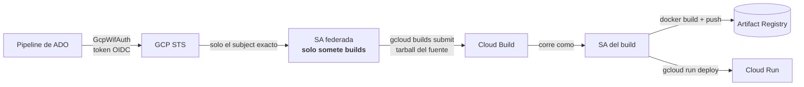

# Cloud Run WIF CI/CD Kit

[](https://github.com/santiagovalenzuelalopez-gif/cloudrun-wif-cicd-kit/actions/workflows/ci.yml)


Kit para desplegar de **Azure DevOps a Cloud Run sin llaves de service account y sin repositorios espejo**, con **mínimo privilegio verificable**: un script idempotente que configura Workload Identity Federation y comprueba que no quedó nada de más, plantillas de pipeline y un `cloudbuild.yaml` de referencia.



## Antes y después

| | Antes | Después |
|---|---|---|
| Fuente hacia GCP | `git push --force` a un **espejo en GitHub** + trigger de Cloud Build conectado a él | `gcloud builds submit` sube el fuente como tarball: Cloud Build **nunca se conecta a un repo** |
| Credenciales | token de GitHub y/o **llave JSON** de service account guardados como secreto | **ninguna**: tokens OIDC de vida corta canjeados en cada ejecución |
| Si el pipeline se compromete | llave válida hasta que alguien la rote | solo puede **someter builds** a la SA del build; sin llaves que robar |
| Configuración de IAM | manual, sin comprobación | `wif-setup.sh verify` falla ante un binding comodín, un rol de más o una llave activa |

## Empezar

```bash
export PROJECT_ID=my-gcp-project
export ADO_ORG_ID=<GUID de la organización de Azure DevOps>
export ADO_SUBJECTS='sc://<org>/<proyecto ADO>/<nombre de la service connection>'   # varios con ';'

./scripts/wif-setup.sh preflight   # 1. SOLO LECTURA: qué hay y qué falta
./scripts/wif-setup.sh plan        # 2. SIMULACIÓN: imprime los comandos
./scripts/wif-setup.sh apply       # 3. aplica y verifica; imprime los valores para ADO
./scripts/wif-setup.sh verify      # 4. SOLO LECTURA: debe terminar con FAIL=0 (repetible)
```

Después, en Azure DevOps:

1. Un administrador de la organización instala la extensión *Google Cloud Auth* y crea una service connection **Google Cloud (WIF)** con los valores que imprimió `apply` (el **nombre** de la conexión y del proyecto deben coincidir exactamente con el subject).
2. Copia [`pipelines/azure-pipelines.yml`](pipelines/azure-pipelines.yml) a la raíz del servicio y edita el bloque `EDITAR`.
3. El servicio necesita un `Dockerfile` y un [`cloudbuild.yaml`](examples/cloudbuild.yaml) que acepte `_SERVICE_NAME` y etiquete la imagen con `${COMMIT_SHA}`.
4. Autoriza el pipeline sobre la conexión la primera vez (ADO lo pide).

Para sumar otro servicio del mismo proyecto de ADO **no hay que tocar GCP**; para otro proyecto de ADO se agrega su subject y se vuelve a ejecutar `apply` (es idempotente).

## Qué contiene

| Ruta | Para qué |
|---|---|
| [`scripts/wif-setup.sh`](scripts/wif-setup.sh) | `preflight` · `plan` · `apply` · `verify`. Crea pool, provider (condición por **subject exacto**), SA federada y permisos mínimos |
| [`pipelines/azure-pipelines.yml`](pipelines/azure-pipelines.yml) | Plantilla estándar (QA): auth federada + `builds submit` |
| [`pipelines/azure-pipelines.prod.yml`](pipelines/azure-pipelines.prod.yml) | Variante de producción con *Environment* y aprobación (**no validada**: ver el encabezado) |
| [`pipelines/templates/`](pipelines/templates) | `gcp-auth.yml` y `deploy-via-cloudbuild.yml` reutilizables |
| [`examples/cloudbuild.yaml`](examples/cloudbuild.yaml) | Contrato de referencia: build, push a Artifact Registry y deploy privado |
| [`docs/`](docs) | [Arquitectura](docs/ARQUITECTURA.md) · [Seguridad](docs/SEGURIDAD.md) · [Troubleshooting](docs/TROUBLESHOOTING.md) · [Migración](docs/MIGRACION.md) |
| [`tests/`](tests) | Pruebas del script contra un `gcloud` simulado y validación de las plantillas |

## Mínimo privilegio, comprobado

Tres identidades con trabajos separados:

| Identidad | Puede | No puede |
|---|---|---|
| **SA federada** (la que asume el pipeline) | someter builds; subir el fuente al bucket de staging; *actuar como* la SA del build | `run deploy`, escribir en el registro, listar buckets, crear llaves |
| **SA del build** (ejecuta Cloud Build) | push al registro, `run deploy`, leer el tarball, escribir logs | ser asumida por nadie que no sea la federada |
| **SA de runtime** (la del servicio) | lo que el servicio necesite | desplegar |

`verify` falla si encuentra: un `principalSet` (binding comodín) sobre cualquier SA, subjects de más o de menos, **cualquier rol de proyecto distinto de `cloudbuild.builds.editor`** en la SA federada, una **llave de usuario activa**, un bucket de staging público, un provider sin condición o con un issuer inesperado, o la SA federada con acceso al registro de imágenes.

## Tests

```bash
bash tests/run.sh            # 56 comprobaciones del script contra un gcloud simulado (sin GCP)
pip install pyyaml pytest
pytest -q                    # 28 comprobaciones de las plantillas y del cloudbuild.yaml
```

El `gcloud` simulado ([`tests/bin/gcloud`](tests/bin/gcloud)) describe un "mundo" en archivos: los tests parten de una configuración conforme y la **estropean de una en una** (comodín, rol extra, llave activa, issuer erróneo, condición por prefijo...) para comprobar que `verify` lo detecta, y verifican que `plan`, `preflight` y `verify` **no modifican nada**. Las plantillas se validan contra las lecciones aprendidas (p. ej. que `GcpWifAuth` nunca lleve `continueOnError`, que `builds submit` pase `--gcs-source-staging-dir` y `COMMIT_SHA`, o que un PR no pueda disparar un despliegue). El CI corre además `shellcheck`.

## Alcance y límites

- **Origen**: el patrón y los scripts se aplicaron en un entorno real de preproducción (build exitoso, revisión con el 100 % del tráfico, `/health` correcto). Esta versión **parametrizada** se prueba contra un `gcloud` simulado: no se ha ejecutado contra un proyecto real en su forma genérica.
- La variante de producción (`azure-pipelines.prod.yml`) **no está validada** de punta a punta.
- El issuer de los tokens de ADO puede cambiar con el tiempo (ver [Arquitectura](docs/ARQUITECTURA.md#adr-6-el-issuer-de-ado-no-es-estable)): `ISSUER_URI` lo hace configurable.
- Solo Azure DevOps. El mismo diseño aplica a otros emisores OIDC cambiando issuer, subject y la tarea de autenticación.

## Licencia

MIT
