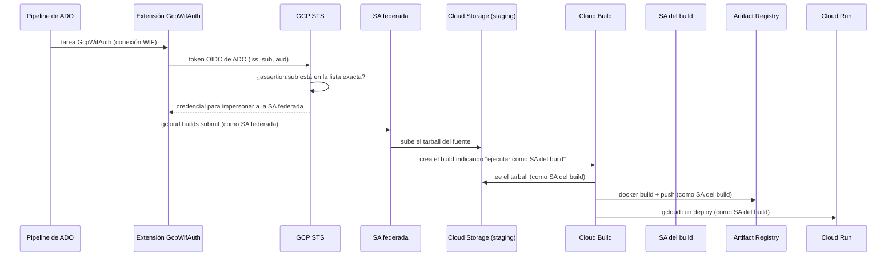

# Arquitectura

## Flujo de un despliegue

## Identidades

| Identidad | Quién la usa | Permisos | Por qué |
|---|---|---|---|
| **SA federada** | el pipeline, vía token federado | `cloudbuild.builds.editor` (proyecto) · `serviceAccountUser` **solo** sobre la SA del build · `objectAdmin` + `legacyBucketReader` sobre el bucket de staging | someter el build y subir el fuente, nada más |
| **SA del build** | Cloud Build | registro (`artifactregistry.writer`), `run.developer`, `logging.logWriter`, `serviceAccountUser` sobre la de runtime, `objectViewer` sobre el staging | construir y desplegar |
| **SA de runtime** | el servicio en Cloud Run | lo que el servicio necesite | ejecutar la aplicación |

## ADR-1: federación de identidades en vez de llaves de service account

**Contexto.** Una llave JSON es una credencial de larga vida que vive como secreto en el sistema de CI: se filtra, se copia, no caduca y rotarla es trabajo manual que rara vez se hace.

**Decisión.** Workload Identity Federation: el pipeline presenta un token OIDC que emite Azure DevOps para esa ejecución; GCP lo valida (issuer, audiencia, condición) y entrega una credencial efímera. No hay ningún secreto de GCP almacenado en ADO.

**Consecuencias.** Nada que robar ni rotar. Coste: configuración inicial (pool, provider, bindings) que este kit automatiza y verifica, y una dependencia del emisor OIDC (ver ADR-6).

## ADR-2: separación de funciones entre tres service accounts

El pipeline podría desplegar directamente con `gcloud run deploy`. Se prefiere que **solo someta builds**:

- Si la identidad federada se compromete (un pipeline modificado, una rama maliciosa), el daño queda acotado a *someter un build como la SA del build*, no a administrar Cloud Run, el registro o el IAM del proyecto.
- La SA del build solo es asumible por la federada (`serviceAccountUser` sobre esa única SA, nunca a nivel de proyecto).
- Las cuentas se pueden auditar por separado: quién *pidió* un build y quién lo *ejecutó* quedan en logs distintos.

`verify` hace cumplir esto: cualquier rol de proyecto distinto de `cloudbuild.builds.editor` en la SA federada es un fallo.

## ADR-3: binding por *subject exacto*, nunca por prefijo ni por pool

El token de ADO trae `sub = sc://<organización>/<proyecto>/<service connection>`. Hay tres formas de autorizarlo, de más a menos segura:

1. **Un `principal://…/subject/` por conexión** (la que usa el kit) + una condición del provider con la **lista exacta** de subjects.
2. Un `principalSet` por atributo (p. ej. por proyecto): cualquier conexión nueva en ese proyecto hereda el acceso.
3. Un `principalSet …/*` por pool: cualquier token del issuer puede impersonar la cuenta.

El kit aplica la (1) **dos veces** (condición del provider *y* binding IAM), y `verify` rechaza cualquier `principalSet` sobre las SAs del proyecto. Cada conexión nueva exige un cambio explícito y revisable.

Un detalle operativo: el nombre del proyecto de ADO va **tal cual** en el subject, con espacios y mayúsculas; el kit lo valida y lo entrecomilla al pasarlo a `gcloud`.

## ADR-4: subir el fuente como tarball en vez de conectar un repositorio

**Antes**, el pipeline copiaba el repo a un espejo en GitHub con `git push --force` y un trigger de Cloud Build conectado a ese espejo construía. Eso exigía un token de GitHub en ADO, mantener un repo duplicado y una cuenta con permiso de escritura forzada.

**Ahora**, `gcloud builds submit` empaqueta el directorio de trabajo del pipeline y lo sube a un bucket de staging; Cloud Build nunca se conecta a un repositorio.

Consecuencias que el kit resuelve:

- Cloud Build lee el tarball **como la SA del build**: necesita `storage.objectViewer` sobre el staging (con un trigger de repo nunca hizo falta).
- Sin `--gcs-source-staging-dir`, `gcloud` verifica el bucket **listando los buckets del proyecto** (`storage.buckets.list`): un permiso que la SA federada no debe tener. Con el staging explícito lo omite, pero aun así necesita `storage.buckets.get` (`legacyBucketReader`).
- `${COMMIT_SHA}` solo lo rellenan los triggers: con `builds submit` hay que pasarlo explícito, o la imagen queda sin tag y el push falla.

## ADR-5: el `cloudbuild.yaml` del repo es la fuente de verdad

El pipeline no reconstruye los flags de `run deploy`. Ejecuta el `cloudbuild.yaml` del servicio, que ya define variables de entorno, secretos, escalado y recursos. Así hay **un solo lugar** donde cambiar la configuración de despliegue y el pipeline es idéntico para todos los servicios (solo cambian `_SERVICE_NAME` y el proyecto). Un fallback que desplegara con `gcloud run deploy` desde la identidad federada se descartó: exigiría darle `run.admin` y escritura en el registro, justo lo que ADR-2 evita.

## ADR-6: el issuer de ADO no es estable

El token de una conexión creada por la extensión usa el issuer `https://vstoken.dev.azure.com/<org-id>`, con un `sub` corto (`sc://org/proyecto/conexión`). Es distinto del issuer de Entra (`login.microsoftonline.com`), que usan las conexiones ARM y que exige un App Registration.

Microsoft ha anunciado la retirada del issuer `vstoken` **para conexiones de ARM**; las creadas por extensiones no figuraban en el anuncio, pero conviene vigilarlo. Si migraran a Entra cambiaría el issuer y el `sub` pasaría a ser una cadena opaca larga, y `google.subject` admite como máximo **127 bytes**: habría que mapear con `assertion.sub.extract(...)`.

Por eso `ISSUER_URI` y `AUDIENCE` son configurables, y `verify` comprueba que el provider tenga exactamente el issuer esperado: un cambio de issuer se detecta, no se descubre cuando falla un despliegue.

## ADR-7: `verify` es una fase de primera clase

Aplicar IAM sin comprobarlo es el origen de los incidentes: durante el trabajo original apareció un binding comodín que nadie había pedido tras un `add-iam-policy-binding` (la sospecha fue el escape de un miembro con espacios en PowerShell). Por eso:

- `apply` termina **siempre** con `verify` y falla si algo no cuadra.
- `verify` es de solo lectura y se puede ejecutar en cualquier momento (p. ej. en una tarea programada) para detectar deriva.
- `preflight` anticipa lo que bloquearía `apply` (permisos, APIs, políticas de organización que restrinjan issuers).
- El script no usa `eval` ni arma comandos como cadenas: cada valor se pasa como argumento entrecomillado, y `plan` imprime los comandos con `printf %q`, de modo que lo que se muestra es lo que se ejecutaría y se puede copiar sin riesgo.
